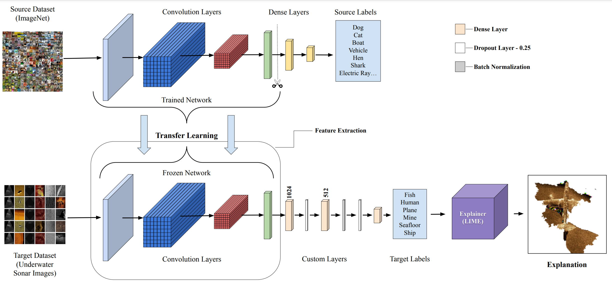

<!--[![Contributors][contributors-shield]][contributors-url]
[![Forks][forks-shield]][forks-url]
[![Stargazers][stars-shield]][stars-url]
[![Issues][issues-shield]][issues-url]
[![MIT License][license-shield]][license-url]
[![LinkedIn][linkedin-shield]][linkedin-url]
-->

# Under-water-sonar-image-classification-with-XAI-LIME

## Architechture

<p align="center">
  
</p>

## TODOs
- [x] Adding demo video.
- [ ] LIME and SP-LIME codes.

## Prerequisites

- Python 3.6 or higher

## Running the Scripts

This guide will help you run the `data_loader.py`, `train.py`, `test.py`, and `predict.py` scripts directly from the command line or a Python script.

### Prerequisites

1. **Python Installation**: Ensure you have Python installed. You can download it from [python.org](https://www.python.org/).

2. **Required Packages**: Install the required packages using `requirements.txt`.
   ```sh
   pip install -r requirements.txt
   ```

### Script Descriptions and Usage

#### 1. `data_loader.py`

This script is used to load, process, split dataset - train, val, tests. and augment data.

**Command Line Usage:**

```sh
python data_loader.py --path <path_to_data> --target_folder <path_to_target_folder> --dim <dimension> --batch_size <batch_size> --num_workers <num_workers> [--augment_data]
```

**Arguments:**

- `--path`: Path to the data.
- `--target_folder`: Path to the target folder where processed data will be saved.
- `--dim`: Dimension for resizing the images.
- `--batch_size`: Batch size for data loading.
- `--num_workers`: Number of workers for data loading.
- `--augment_data` (optional): Flag to enable data augmentation.

**Example:**

```sh
python data_loader.py --path "./data" --target_folder "./processed_data" --dim 224 --batch_size 32 --num_workers 4 --augment_data
```

#### 2. `train.py`

This script is used for training and storing the models leveraging transfer learning.

**Command Line Usage:**

```sh
python train.py --base_model_names <model_names> --shape <shape> --data_path <data_path> --log_dir <log_dir> --model_dir <model_dir> --epochs <epochs> --optimizer <optimizer> --learning_rate <learning_rate> --batch_size <batch_size>
```

**Arguments:**

- `--base_models`: Comma-separated list of base model names (e.g., 'vgg16,alexnet').
- `--shape`: Image shape (size).
- `--data_path`: Path to the data.
- `--log_dir`: Path to the log directory.
- `--model_dir`: Path to the model directory.
- `--epochs`: Number of training epochs.
- `--optimizer`: Optimizer type ('adam' or 'sgd').
- `--learning_rate`: Learning rate for the optimizer.
- `--batch_size`: Batch size for training
- `--patience`: Patience for early stopping (to prevent over-fitting).

**Example:**

```sh
python train.py --base_models "vgg16,alexnet" --shape 224 224 3 --data_path "./data" --log_dir "./logs" --model_dir "./models" --epochs 100 --optimizer "adam" --learning_rate 0.001 --batch_size 32
```

#### 3. `test.py`

This script is used for testing and storing the test logs of the trained models.

**Command Line Usage:**

```sh
python test.py --data_path <data_path> --base_model_name <base_model_name> --model_path <model_path> --models_folder_path <models_folder_path> --log_dir <log_dir>
```

**Arguments:**

- `--models_dir` (optional): Path to the Models (directory)
- `--model_path`: Path to the Model (.h5/Keras Model)
- `--img_path`: Path to the image file
- `--test_dir`: Path to the test dataset (directory)
- `--train_dir`: Path to the train data (to the decoder).
- `--log_dir`: Path to the log directory.

**Example:**

```sh
python test.py --model_path "./models/vgg16_model.pth" --test_dir "./test_data" --train_dir ".data/train" --log_dir "./logs"
```

#### 4. `predict.py`

This script is used for making predictions on new images.

**Command Line Usage:**

```sh
python predict.py --model_path <model_path> --img_path <img_path> --train_dir <train_dir>
```

**Arguments:**

- `--model_path`: Path to the model file.
- `--img_path`: Path to the image file.
- `--train_dir`: Path to the training dataset.

**Example:**

```sh
python predict.py --model_path "./models/vgg16_model.pth" --img_path "./images/test_image.jpg" --train_dir "./data/train"
```

### Running Scripts in a Python Script

You can also run these scripts programmatically using Python's `subprocess` module specially for Jupyter Notebook users. Here is an example of how to do this for each script:

```python
import subprocess

# Run data_loader.py
subprocess.run([
    "python", "data_loader.py",
    "--path", "./data",
    "--target_folder", "./processed_data",
    "--dim", "224",
    "--batch_size", "32",
    "--num_workers", "4",
    "--augment_data"
])

# Run train.py
subprocess.run([
    "python", "train.py",
    "--base_models", "vgg16,alexnet",
    "--shape", "224, 224, 3",
    "--data_path", "./data",
    "--log_dir", "./logs",
    "--model_dir", "./models",
    "--epochs", "100",
    "--optimizer", "adam",
    "--learning_rate", "0.001",
    "--batch_size", "32",
    "--patience", "10"
])

# Run test.py
subprocess.run([
    "python", "test.py",
    "--models_dir", "./models",
    "--img_path", "./data/test/img.jpg"
    "--test_dir", "./test",
    "--train_dir", "./data/train",
    "--model_path", "./models/vgg16_model.pth",
    "--log_dir", "./logs"
])

# Run predict.py
subprocess.run([
    "python", "predict.py",
    "--model_path", "./models/vgg16_model.pth",
    "--img_path", "./images/test_image.jpg",
    "--train_dir", "./data/train"
])
```

----
[contributors-shield]: https://img.shields.io/github/contributors/Purushothaman-natarajan/Under-water-sonar-image-classification.svg?style=flat-square
[contributors-url]: https://github.com/Purushothaman-natarajan/Under-water-sonar-image-classification/graphs/contributors
[forks-shield]: https://img.shields.io/github/forks/Purushothaman-natarajan/Under-water-sonar-image-classification.svg?style=flat-square
[forks-url]: https://github.com/Purushothaman-natarajan/Under-water-sonar-image-classification/network/members
[stars-shield]: https://img.shields.io/github/stars/Purushothaman-natarajan/Under-water-sonar-image-classification.svg?style=flat-square
[stars-url]: https://github.com/Purushothaman-natarajan/Under-water-sonar-image-classification/stargazers
[issues-shield]: https://img.shields.io/github/issues/Purushothaman-natarajan/Under-water-sonar-image-classification.svg?style=flat-square
[issues-url]: https://github.com/Purushothaman-natarajan/Under-water-sonar-image-classification/issues
[license-shield]: https://img.shields.io/github/license/github.com/Purushothaman-natarajan/Under-water-sonar-image-classification.svg?style=flat-square
[license-url]: https://github.com/Purushothaman-natarajan/Under-water-sonar-image-classification/blob/main/LICENSE
[linkedin-shield]: https://img.shields.io/badge/-LinkedIn-black.svg?style=flat-square&logo=linkedin&colorB=555
[linkedin-url]: https://www.linkedin.com/in/purushothamann/
